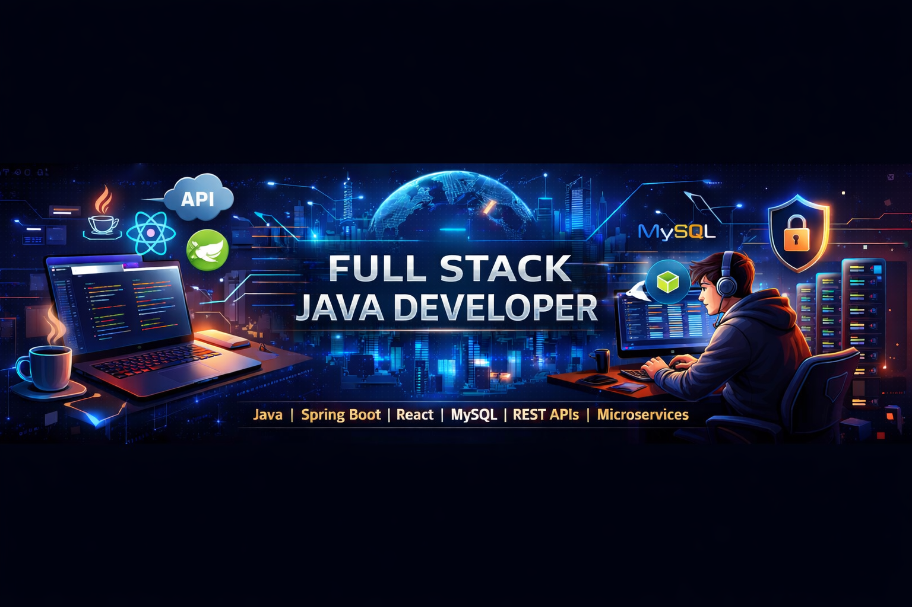

<!--  -->

# Hi 👋, I'm Aditya

### 🚀 Java Full Stack Developer | Spring Boot | React | REST APIs

---

# 💫 About Me

🔭 **I’m currently working on**

* Full Stack Web Applications using **Java, Spring Boot, React & MySQL**
* Building **secure REST APIs with Spring Security & JWT Authentication**
* Developing **modern responsive UI with React and CSS**

👯 **I’m looking to collaborate on**

* Open Source **Java / Spring Boot projects**
* Full Stack **Web Development applications**
* Projects involving **REST APIs & Microservices**

🤝 **I’m looking for help with**

* **Advanced Spring Security & OAuth2**
* **Microservices Architecture with Spring Cloud**

🌱 **I’m currently learning**

* **System Design & Scalable Backend Architecture**
* **Microservices with Spring Boot**
* **Advanced React & State Management**

💬 **Ask me about**

* Java & Spring Boot Development
* REST API Design & Backend Architecture
* Full Stack Development (**Java + React**)
* Database Design with **MySQL**

⚡ **Fun fact**

* I enjoy turning **complex problems into clean and scalable code**
* I love building **real-world full stack applications from scratch**

---

# 🌐 Connect With Me

---

# 💻 Tech Stack

### 👨‍💻 Programming Languages

### ⚙️ Backend Development

### 🎨 Frontend Development

### 🗄️ Database

### 🛠 Tools

---

# 🚀 Featured Projects

### 📝 Todo List Full Stack Application

**Tech Stack:** Java, Spring Boot, React, MySQL, JWT

* Secure authentication using **Spring Security + JWT**
* Full Stack **CRUD operations**
* REST APIs built using **Spring Boot**
* Responsive frontend built with **React**

🔗 https://github.com/adityakumbhar0111/TodoList_App_SpringBoot

---

### 🔐 Spring Security Authentication System

**Tech Stack:** Java, Spring Boot, Spring Security, MySQL

* Secure **Login & Registration**
* JWT Token authentication
* Role-based authorization

---

### 📊 REST API Backend System

**Tech Stack:** Java, Spring Boot, Hibernate, MySQL

* Designed scalable **REST APIs**
* Implemented **CRUD operations**
* Tested APIs using **Postman & Swagger**

---

# 📊 GitHub Stats

---

# 🔥 GitHub Streak

---

# 📈 GitHub Contribution Graph

---

# 🏆 GitHub Achievements

---

# 🐍 Contribution Snake

---

# ✍️ Random Dev Quote

---

# 👀 Profile Visitors

---

⭐ **From [Aditya](https://github.com/adityakumbhar0111)**
